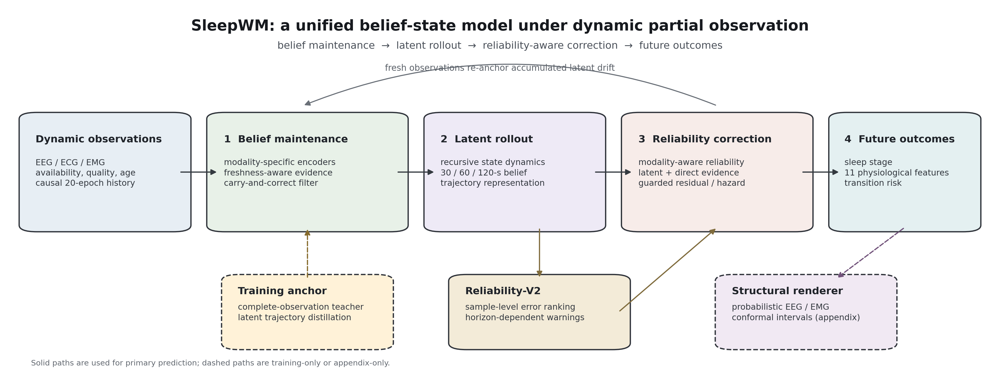

# SleepWM

**Maintaining and forecasting latent physiological belief under dynamic partial observation**

[](https://www.python.org/)
[](https://pytorch.org/)
[](LICENSE)

SleepWM is a causal multimodal world model for EEG, ECG, and EMG. It is designed
for continuous monitoring in which physiological sensors can become noisy,
stale, asynchronous, or temporarily unavailable while the underlying human
state continues to evolve.

Rather than reconstructing every missing waveform before prediction, SleepWM
maintains a task-relevant latent belief, recursively advances that belief during
observation gaps, and corrects accumulated drift when reliable measurements
return. The same belief supports future sleep-stage, physiological-feature, and
sleep-transition forecasting.



## Highlights

- Modality-specific causal frontends for EEG, ECG, and EMG.
- Freshness-aware carry-and-correct latent filtering.
- Recursive latent rollout over 30, 60, and 120 seconds.
- Reliability-aware correction when sensors recover.
- Future sleep-stage, physiological-feature, and transition-event heads.
- Training and evaluation under hard interruption, gradual quality decay,
  asynchronous loss, and sensor recovery.
- Dynamic-missingness baselines including GRU-D, BRITS, SAITS, PatchTST, RSSM,
  mTAN, Raindrop, and masked Transformers.

The learned representation is a predictive belief for the evaluated tasks. It
is not claimed to be the unique biological state of a person.

## Repository layout

```text
assets/                 README figures
checkpoints/            Frozen SleepWM weights and SHA-256 manifest
configs/                SleepWM, pretraining, and baseline configurations
data/                   Dataset links and manifest contract
docs/                   Model, protocol, and reproducibility documentation
scripts/                Smoke-test entrypoint
src/sleepwm/            Public Python namespace
src/uniphysio_wm/       Checkpoint-compatible implementation namespace
tests/                  Causality, masking, model, and protocol tests
tools/                  Data preparation and utility scripts
train_sleepwm.py        Main SleepWM training entrypoint
test_sleepwm.py         Main SleepWM evaluation entrypoint
```

The manuscript, submission PDF, participant-level statistics, and intermediate
analysis files are intentionally not part of this source repository.

## Datasets

Raw polysomnography is not redistributed. Download each dataset under its own
license and citation requirements.

| Dataset | Role | Official source |
| --- | --- | --- |
| HMC Sleep Staging Database | Primary cohort | [PhysioNet](https://physionet.org/content/hmc-sleep-staging/1.1/) |
| CAP Sleep Database | Primary multimodal cohort | [PhysioNet](https://physionet.org/content/capslpdb/1.0.0/) |
| ISRUC-SLEEP | External evaluation | [ISRUC](https://sleeptight.isr.uc.pt/) |
| Sleep-EDF Expanded | External transfer and recovery | [PhysioNet](https://physionet.org/content/sleep-edfx/1.0.0/) |

See [data/README.md](data/README.md) and
[docs/DATA_CONTRACT.md](docs/DATA_CONTRACT.md) for channel mapping, manifests,
participant-disjoint splits, and leakage controls.

## Installation

```bash
conda create -n sleepwm python=3.10
conda activate sleepwm
pip install -e ".[dev,data]"
```

For a CUDA installation, install the appropriate PyTorch build from
[pytorch.org](https://pytorch.org/get-started/locally/) before installing the
remaining dependencies.

## Quick verification

The public software path can be tested without private PSG data:

```bash
bash scripts/run_smoke_test.sh
```

This command creates synthetic data, validates the public configurations,
checks the package boundary, and runs the causal partial-observation tests. Toy
outputs are never used as scientific evidence.

## Data preparation

Prepare participant-disjoint manifests before training:

```bash
python tools/prepare_cap.py --help
python tools/prepare_external_sleep.py --help
python tools/compute_normalization.py --help
```

Expected manifest paths are documented in [data/README.md](data/README.md).
Normalization and physiological-feature statistics must be computed from
training participants only.

## Pretraining

Masked multimodal pretraining is available through:

```bash
python pretrain.py --config configs/pretrain/masked_multimodal.yaml
```

The pretraining and complete-observation teacher checkpoints initialize the
causal belief model. The final frozen SleepWM checkpoints are bundled under
`checkpoints/`; upstream teacher and initializer artifacts can be regenerated
through the staged training pipeline.

## SleepWM training

Update the local manifest and checkpoint paths in
`configs/sleepwm/train.yaml`, then run:

```bash
python train_sleepwm.py --config configs/sleepwm/train.yaml
```

An explicit initialization checkpoint can be supplied from the command line:

```bash
python train_sleepwm.py \
  --config configs/sleepwm/train.yaml \
  --initial-checkpoint path/to/sleepwm_initializer.pt
```

## Evaluation

Validation evaluation uses the same dynamic observation protocol as training:

```bash
python test_sleepwm.py \
  --config configs/sleepwm/evaluate.yaml \
  --checkpoint checkpoints/sleepwm_backbone/run_01.pt \
  --split val
```

Frozen test evaluation requires the explicit test-unlock flag and validation-
selected event thresholds. See [docs/EXPERIMENT_PROTOCOL.md](docs/EXPERIMENT_PROTOCOL.md)
before using the test partition.

## Baselines

Baseline configurations are under `configs/baseline/` and
`configs/dynamic_baselines/`. For example:

```bash
python train_baseline.py --config configs/baseline/multimodal_transformer.yaml
python train_dynamic_missing_baseline.py \
  --config configs/dynamic_baselines/dynamic_saits.yaml
```

Every comparison should reuse the same participant split, causal history,
missingness schedule, forecast horizons, and checkpoint-selection policy.

## Python API

```python
import sleepwm

model_class = sleepwm.RecursiveBeliefCarryCorrectWorldModel
print(sleepwm.__version__)
```

The `uniphysio_wm` namespace remains only for frozen checkpoint and script
compatibility. The public project and model name are SleepWM.

## Checkpoints

One matched lightweight inference set is included: backbone, outcome heads,
recovery gate, and reliability estimator. Their roles and SHA-256 values are
listed in [checkpoints/README.md](checkpoints/README.md) and
[checkpoints/MANIFEST.json](checkpoints/MANIFEST.json).

## Reproducibility

- [Model contract](docs/MODEL_CONTRACT.md)
- [Experiment protocol](docs/EXPERIMENT_PROTOCOL.md)
- [Reproducibility checklist](docs/REPRODUCIBILITY.md)
- [Release status](docs/RELEASE_STATUS.md)

## Citation

Citation metadata are provided in [CITATION.cff](CITATION.cff). Replace the
repository-owner, venue, and DOI placeholders when the paper and archival
release become public.

## License

The source code is released under the [MIT License](LICENSE). Dataset licenses,
access terms, and citation requirements remain with the original providers.
