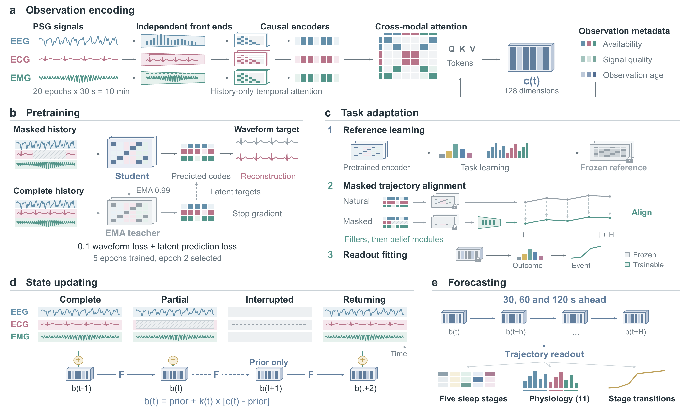

# SleepWM

### An observational world model for multimodal sleep state completion and forecasting

SleepWM connects cross-modal physiological learning with predictive-state maintenance under changing sensor availability. Given ten minutes of EEG, ECG and EMG history, it forecasts **sleep stages, continuous physiology and stage transitions 30, 60 and 120 seconds ahead**, while retaining and updating information as sensors disappear and return.

This repository provides the research implementation accompanying **“SleepWM is an observational world model for multimodal sleep state completion and forecasting.”**

[Overview](#overview) · [Results](#results) · [Installation](#installation) · [Data](#data-preparation) · [Training](#training) · [Inference](#inference) · [Evaluation](#evaluation) · [Citation](#citation)

## Overview

<p align="center">
  
</p>

**Figure 1. SleepWM framework.** Modality-specific front ends and a shared encoder integrate EEG, ECG and EMG. Cross-modal pretraining and reference-guided adaptation support state maintenance through partial observation, interruption and return. Task-specific readouts predict future sleep stages, physiology and transitions. The final physiology and event readouts also include a GRU-D direct-observation branch. The diagram is schematic; neither training teacher is required at inference. [View at full resolution](assets/figure1.png).

### Prediction tasks

| Input / output | Specification |
| --- | --- |
| Observation history | 20 × 30-second epochs at 128 Hz; modalities ordered EEG, ECG, EMG |
| Primary forecast horizons | 30, 60 and 120 seconds after the history endpoint |
| Future sleep stage | Wake, N1, N2, N3 or REM at each anchor |
| Future physiology | 11 continuous features, standardized using training-set statistics |
| Transition risk | Probability of at least one adjacent sleep-stage change before each anchor |

These outputs describe future outcomes rather than classifications of the observed epochs. State completion means retaining or recovering task-relevant information in the predictive state; it does not assume a unique reconstruction of every missing waveform.

### Learning and state maintenance

1. **Cross-modal pretraining.** Masked waveform reconstruction and contextual latent prediction learn complementary signal representations from EEG, ECG and EMG without sleep labels. An exponential-moving-average teacher supplies latent targets. The archived run trained for five epochs and selected epoch 2; global consistency loss was disabled.
2. **Reference learning.** The pretrained encoder initializes task training and the forecasting, physiology and observation-repair modules inherited by the final system.
3. **Masked-history adaptation.** A frozen task-trained reference guides alignment of partial-view states and state changes. Availability, retained observations, observation age and reliability inform state correction when evidence is lost or returns.
4. **Readout fitting.** Outcome and event adapters are fitted separately. The final physiology and transition predictions combine latent-state information with a trained GRU-D direct-observation branch.

At inference, a predict-correct filter processes the history. Primary forecasts use future-state anchors corrected by the discrepancy at the history endpoint, followed by task-specific readouts. History-state propagation and the longer recursive extension play distinct roles. The reported primary results belong to the complete six-component system described in [Inference](#inference).

## Results

The primary benchmark holds participants, history length, future targets and horizons fixed while changing the observed evidence. It uses **40 held-out HMC+CAP participants** and compares SleepWM with eight systems under the same forecasting protocol.

| Observation regime | Future-stage Macro-F1 ↑ | Standardized physiology MAE ↓ | Transition AUPRC ↑ |
| --- | ---: | ---: | ---: |
| Complete EEG+ECG+EMG | 0.6725 | 0.3837 | 0.4170 |
| Dynamic partial observation | 0.5537 | 0.4361 | 0.3290 |

Values are manuscript means across three downstream training runs initialized from a shared pretrained checkpoint (Supplementary Tables S1-S4). The three forecast horizons are weighted equally; the partial-observation summary additionally averages eight fixed conditions equally.

SleepWM had the highest numerical mean for future staging and physiology among the evaluated comparators in both regimes. Under partial observation, transition AUPRC was 0.3290 versus 0.3298 for BRITS; the prespecified participant-level test did not establish transition superiority (Benjamini-Hochberg-adjusted *p* = 0.174). Model capacity and total optimization budgets were not matched, so these comparisons concern the complete learning systems under the reported configurations.

### Cohorts

| Cohort | Participants | Train | Validation | Test | Evaluation role |
| --- | ---: | ---: | ---: | ---: | --- |
| HMC | 151 | 104 | 23 | 24 | Internal development and test |
| CAP | 107 | 78 | 13 | 16 | Internal development and test |
| HMC+CAP | 258 | 182 | 36 | 40 | Combined internal split; primary frozen test |
| ISRUC | 100 | 70 | 17 | 13 | External transfer |
| Sleep-EDF | 100 | 65 | 22 | 13 | External transfer; 197 recordings |

All splits are participant-disjoint; HMC+CAP summarizes the first two rows. Most component and sensor-combination analyses use the 36 internal validation participants. Source-only external tests assess future staging on 13 participants per cohort. Sleep-EDF has no matched ECG channel, which is marked unavailable.

## Installation

Use **Python 3.10 or later**. Dependencies are declared in [pyproject.toml](pyproject.toml): NumPy, SciPy, PyYAML, scikit-learn and PyTorch. The `dev` extra adds pytest. Run commands from the repository root; examples use Bash unless marked otherwise.

```bash
git clone https://github.com/JZK00/SleepWM.git
cd SleepWM
python -m pip install -e '.[dev]'
```

### First checks

The following commands do not require study data or pretrained weights:

```bash
CUDA_VISIBLE_DEVICES='' python -m pytest -q
python train.py --list
python prepare_data.py toy --output-dir .toy_data
```

Toy records are synthetic inputs for software checks. Model inference requires compatible trained checkpoints, including for `evaluate.py --synthetic`. Recordings and pretrained weights are not distributed in this repository.

For GPU execution, set `CUDA_VISIBLE_DEVICES` explicitly and address the selected GPU as `cuda:0`. On Windows PowerShell:

```powershell
$env:CUDA_VISIBLE_DEVICES = ''
python -m pytest -q

# For training with a CUDA-enabled PyTorch installation:
$env:CUDA_VISIBLE_DEVICES = '0'
python train.py --stage pretrain --device cuda:0
```

## Repository structure

```text
train.py                 Unified staged-training entry point
evaluate.py              Dynamic-observation evaluation and synthetic inference
prepare_data.py          Normalization, feature extraction and toy records
sleepwm/                 Encoders, state updates, readouts and shared utilities
  model.py               Six-component inference API
  training/              Training implementations
configs/
  training.yaml          27 stage records and checkpoint dependencies
  checkpoints.json       Six inference checkpoint paths
tests/                   State/masking and readout regression tests
assets/figure1.png        Framework overview
CITATION.cff             Software citation metadata
LICENSE                  MIT license
pyproject.toml           Package metadata and dependencies
```

## Data preparation

### Record format

Obtain recordings through the dataset providers and follow their licenses and access procedures. Prepare each recording as an NPZ with the following fields:

| Field | Shape | Description |
| --- | --- | --- |
| `signals` | `[epochs, 3, 3840]` | 30-second epochs at 128 Hz, ordered EEG, ECG, EMG |
| `labels` | `[epochs]` | Wake=0, N1=1, N2=2, N3=3, REM=4 |
| `modality_present` | `[epochs, 3]` | Boolean modality availability |

Signals retain physical units before train-fitted normalization. Harmonize S3 and S4 to N3. Mark unavailable channels through the mask rather than treating zero-valued input as an observed channel.

A CSV manifest requires `record_id,subject,split,npz_path`. Use `train`, `val` and `test` for split names. NPZ paths may be absolute or relative to the manifest. Prefix participant identifiers by cohort and keep each participant in exactly one split.

The manuscript uses HMC EEG C4-M1, ECG and chin EMG; CAP primarily uses C4-A1, ECG1-ECG2 and EMG1-EMG2, with prespecified homologous mappings where needed. Sleep-EDF uses Fpz-Cz EEG and submental EMG with ECG unavailable. Exact replication requires the original channel choices, preprocessing and participant splits in addition to the input schema.

### Normalization and targets

```bash
python prepare_data.py normalize \
  --manifest data/manifests/hmc_cap_processed_manifest.csv \
  --output data/manifests/hmc_cap_train_normalization.json

python prepare_data.py features \
  --manifest data/manifests/hmc_cap_processed_manifest.csv \
  --output-dir data/features
```

Normalization and feature statistics are fitted on training participants only. Feature extraction writes `feature_manifest.csv`, per-record feature NPZ files and `feature_statistics.json`.

| Modality | Physiological targets |
| --- | --- |
| EEG (5) | Log delta, theta, alpha and beta power; spectral centroid |
| ECG (3) | Heart rate, median RR interval and RMSSD |
| EMG (3) | Log RMS amplitude, log mean rectified amplitude and high-frequency power ratio |

EEG bands are 0.5-4, 4-8, 8-13 and 13-30 Hz; the spectral centroid spans 0.5-30 Hz. The EMG ratio is 20-45 Hz power divided by 5-45 Hz power. Invalid ECG targets are excluded by feature-validity masks. Reported physiology MAE uses standardized targets.

The `features` CLI accepts training/validation splits and computes training statistics; it does not accept `--splits test`. For held-out evaluation, prepare test feature records separately using the frozen training statistics and a compatible feature manifest. Do not refit statistics on test participants. Each data subcommand exposes `--help`.

## Training

[configs/training.yaml](configs/training.yaml) records 27 selected-run stages and their checkpoint dependencies. Export a stage to obtain an editable standalone configuration:

```bash
python train.py --list
python train.py --stage pretrain --export-config pretrain.local.yaml
python train.py --stage pretrain --stage-help
CUDA_VISIBLE_DEVICES=0 python train.py \
  --stage pretrain --config pretrain.local.yaml --device cuda:0
```

The training lineage includes cross-modal pretraining, task-trained reference construction, PO2 carry/correct adaptation, PO3 belief-state training, the PO4 outcome adapter, the GRU-D branch and hazard head, PO17 physiology/hazard adaptation and PO18 event correction. Follow the **`requires` fields printed by `--list`** for the actual dependency order. Waveform-related modules remain where they are inherited by the final checkpoint.

Edit exported configs for local data and checkpoint paths. Trainer-specific options such as `--epochs`, `--seed` and `--output-dir` are forwarded to the selected trainer; consult `--stage-help`. Checkpoint-driven event stages inherit data settings from their input checkpoints.

Training writes to configured `outputs/` directories. Checkpoint loading can use the corresponding `outputs/` file when a configured `checkpoints/` path is absent. Use fresh output directories and update dependent paths together. `SLEEPWM_DATA_ROOT` and `SLEEPWM_CHECKPOINT_ROOT` relocate standard paths embedded in loaded checkpoint configurations.

The supplied configuration lineage is for seed `20260804`. The manuscript's downstream repetitions share a pretrained initialization; weights for all repetitions are not included.

## Inference

The final system loads six compatible checkpoint files from [configs/checkpoints.json](configs/checkpoints.json):

| Key | Component |
| --- | --- |
| `state` | PO3 recursive belief-state model |
| `outcome` | PO4 trajectory-conditioned outcome adapter |
| `direct` | GRU-D direct-observation branch |
| `latent_hazard` | PO17 gated physiology/hazard adapter |
| `direct_event` | Hazard head for the GRU-D branch |
| `event_correction` | PO18 reliability-gated event correction |

Supply all six from a compatible training lineage and update their paths in the JSON. Payloads contain configuration mappings and model/adapter state dictionaries. Use trusted checkpoints.

### Synthetic inference

After obtaining the six checkpoints:

```bash
CUDA_VISIBLE_DEVICES='' OMP_NUM_THREADS=4 python evaluate.py \
  --checkpoints configs/checkpoints.json --device cpu --synthetic
```

This checks complete observation, all-sensor loss, EEG loss and return after a gap without opening a dataset. It validates finite outputs, normalized stage probabilities, and bounded nondecreasing cumulative transition risk.

### Python API

```python
import json
import torch
from sleepwm import SleepWM

with open('configs/checkpoints.json', encoding='utf-8') as handle:
    model = SleepWM.from_checkpoints(json.load(handle), device='cpu')

# Synthetic normalized inputs: [batch, history, modalities, samples].
signals = torch.randn(1, 20, 3, 3840)
present = torch.ones(1, 20, 3, dtype=torch.bool)
present[:, -4:, 0] = False  # EEG absent for the final 120 seconds.
signals = signals * present.unsqueeze(-1)
outputs = model(signals, present)

primary = [model.horizons.index(h) for h in (1, 2, 4)]
print(outputs['stage_probabilities'][:, primary].shape)  # [1, 3, 5]
print(outputs['future_physiology'][:, primary].shape)    # [1, 3, 11]
print(outputs['transition_risk'][:, primary].shape)      # [1, 3]
```

For real data, apply training-set normalization and zero unavailable signals **after normalization**. Modality order is EEG, ECG, EMG. Forecast axes follow `model.horizons`. The supplied configurations use `[1, 2, 4, 10, 14]`, giving five output anchors. The example selects the primary offsets `[1, 2, 4]` (30, 60 and 120 seconds); the 300- and 420-second anchors serve longer-range descriptive and boundary analyses. The API also returns `stage_logits` and `interval_hazard`. Transition risk is cumulative through each anchor; interval hazard describes the successive interval.

## Evaluation

### Primary observation protocol

```bash
CUDA_VISIBLE_DEVICES=0 python evaluate.py \
  --checkpoints configs/checkpoints.json --device cuda:0 \
  --split val --protocol primary --output outputs/validation.json
```

The evaluator reports complete observation and eight fixed partial-observation conditions:

| Condition | Change within the history |
| --- | --- |
| `hard_eeg_1ep`, `hard_eeg_4ep`, `hard_eeg_10ep` | EEG loss for 30, 120 or 300 seconds |
| `hard_all_1ep`, `hard_all_4ep`, `hard_all_10ep` | All-sensor loss for 30, 120 or 300 seconds |
| `linear_decay_all_4ep` | All-sensor linear decay over 120 seconds |
| `asynchronous_eeg4_ecg2_emg1` | EEG/ECG/EMG loss over 120/60/30 seconds |

“Dynamic” refers to changing evidence within a history. Evaluation uses fixed masks. The JSON `dynamic` summary averages the eight partial conditions equally and excludes complete observation. Top-level endpoints average the three primary horizons; `by_horizon` keys use epoch offsets.

Validation is the default split. With held-out feature records prepared, pass `--split test` explicitly for test evaluation. Reports record `split` and `test_split_accessed`. Use `--data-config local_data.yaml` to override `data` and `physiology` path fields, and `--batch-size`/`--workers` to control loading and inference batches.

### Retained-view protocol

`--protocol multiview` evaluates complete observation and the six retained single/pair modality combinations. Each reduced view applies to the last 30, 60, 90, 120, 180 or 300 seconds, following earlier multimodal context:

```bash
CUDA_VISIBLE_DEVICES=0 python evaluate.py \
  --checkpoints configs/checkpoints.json --device cuda:0 \
  --split val --protocol multiview --output outputs/multiview_validation.json
```

Continuation after multimodal context differs from using one sensor throughout the history. Earlier outcome-adapter diagnostics, external-transfer analyses and interruption-route comparisons also use separately specified protocols and should be interpreted separately from the final-system benchmark.

## Reproducibility

The repository provides model inference, staged training, normalization, feature extraction and dynamic-observation evaluation. Provider-specific EDF conversion, frozen participant-split manifests, pretrained weights, study outputs, external-transfer scripts, figure-generation code and the complete comparator/statistical analysis pipelines are not bundled. Obtain or generate those artifacts separately for the corresponding manuscript analyses.

Archived CPU verification used Python 3.10 and PyTorch 2.6.0: 21 targeted tests, argument parsing for all 27 stages, and synthetic end-to-end data preparation/evaluation. The six archived checkpoints contained 4,168,163 parameters and matched the previous implementation exactly on complete observation, all-sensor loss, EEG loss and recovery after a gap. These checks establish software compatibility; full training was not rerun. The manuscript experiments used Linux, Python 3.8.10, PyTorch 2.2.2+cu121 and an RTX 3090, distinct from this package's Python requirement.

Study results derive from retrospective controlled observation changes. Naturally occurring failures, prospective device performance and clinical workflows require further evaluation. The learned state is observational, and component ablations do not establish recursion alone as the source of the complete system's advantage.

## Citation

Software metadata are provided in [CITATION.cff](CITATION.cff). Cite the accompanying manuscript under its title:

> *SleepWM is an observational world model for multimodal sleep state completion and forecasting.*

A public manuscript link and permanent archival software identifier will be added when available.

## License and acknowledgements

The code is distributed under the [MIT license](LICENSE), with the original notice retained. Dataset access and redistribution follow provider licenses; dependencies retain their own licenses.

The final readout includes GRU-D. Attribution: Che et al., *Recurrent Neural Networks for Multivariate Time Series with Missing Values*, Scientific Reports 8, 6085 (2018), [doi:10.1038/s41598-018-24271-9](https://doi.org/10.1038/s41598-018-24271-9).
